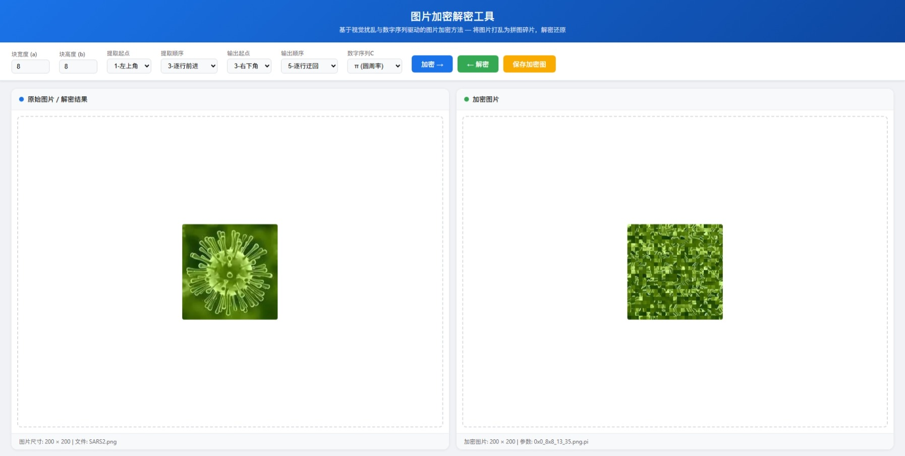

# 基于视觉扰乱与数字序列驱动的图片加密解密方法研究

本项目为AI根据作者的一种类似puzzle方式的图片加密、解密算法的构思生成的论文及相关代码。灵感来源于中国国家标准网国标预览图片。

演示：  

tools目录下为agent沙箱内生成图片和文档的工具脚本，只记录未验证是否可正常运行。
de-puzzle目录下为AI生成的puzzle解算器，解算效果不理想，说明加密算法效果良好。

构思及测试：toohoovv  
论文撰写及代码实现：GLM 5.1 Agent@z.ai
