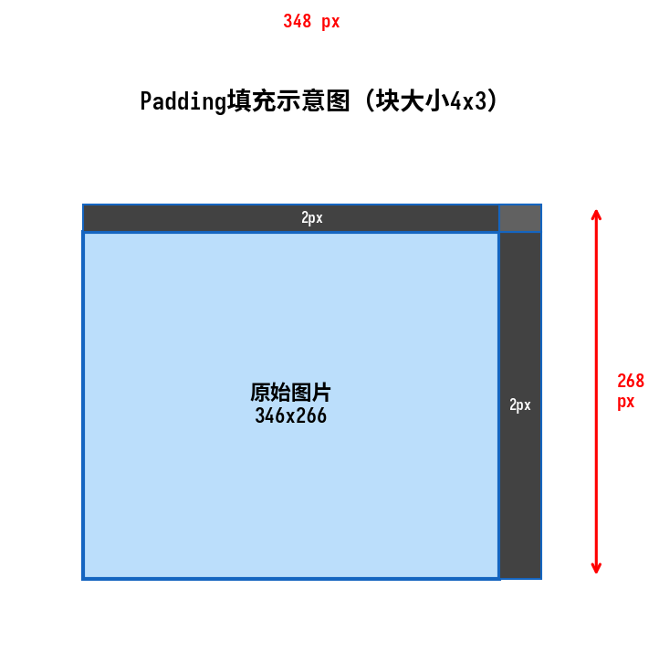
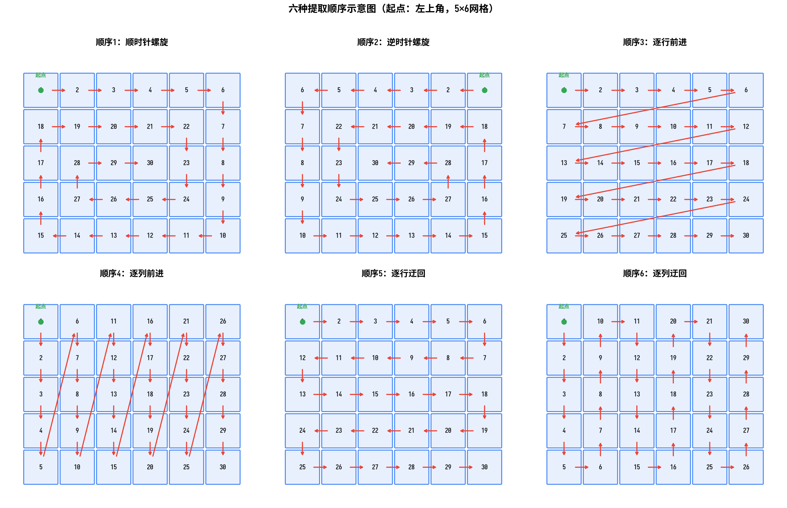
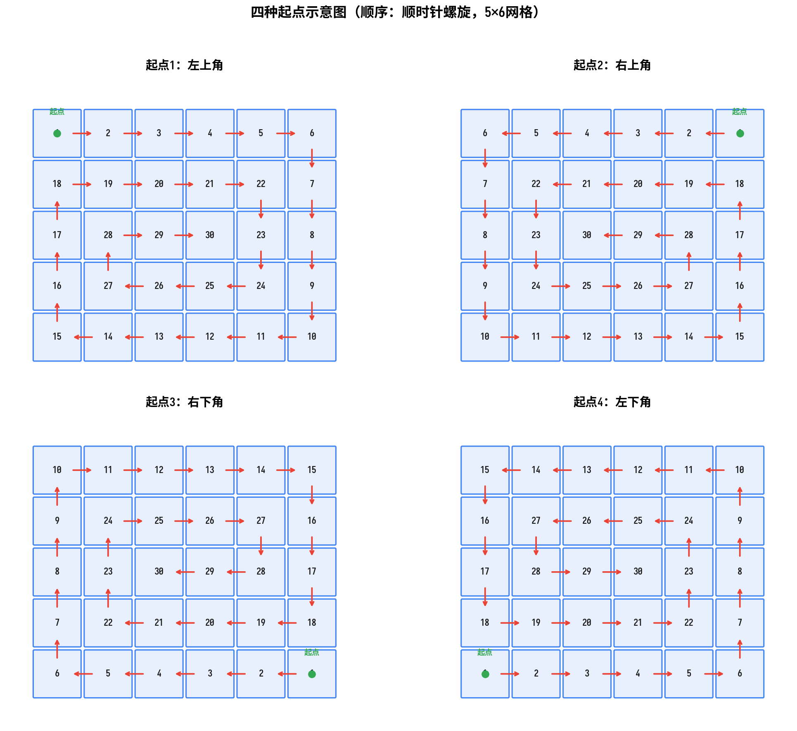
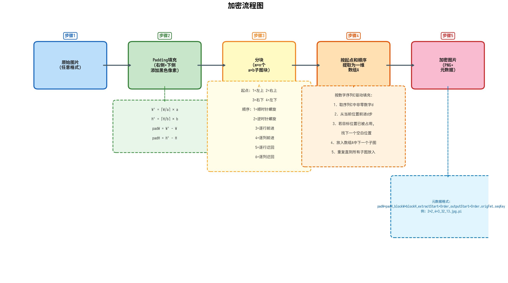
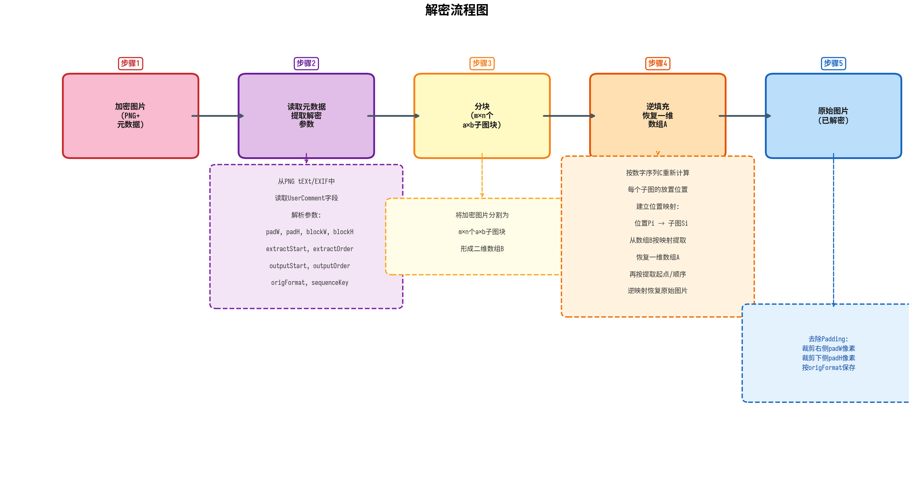
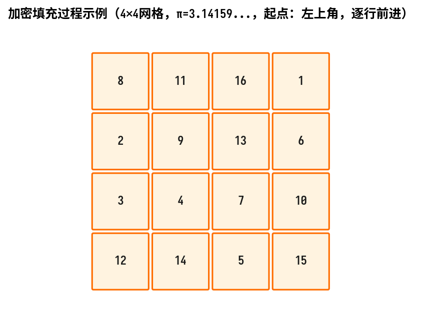

# 基于视觉扰乱与数字序列驱动的图片加密解密方法研究

**摘要**：随着数字图像在互联网中的广泛传播，图像信息安全问题日益突出。本文提出了一种基于视觉扰乱与数字序列驱动的图片加密解密方法，其核心思想是将原始图片分割为若干固定大小的小图块，按照预设的起点和顺序提取为一维子图片数组，再利用十进制数字序列（如圆周率π、自然常数e等）驱动的填充规则将子图片数组重新排列到空白网格中，形成视觉上完全混乱的加密图片。解密过程通过加密图片EXIF信息中存储的解密参数逆向恢复原始图片。该方法具有密钥空间大、实现简单、无需复杂变换运算等优点，适用于对图像内容进行轻量级保护。本文详细描述了加密解密算法的原理与实现，分析了其安全性，并给出了基于OpenCV和Pillow两种Python库的实现方案及Web交互式演示工具。

**关键词**：图片加密；视觉扰乱；数字序列；分块重排；EXIF元数据

---

## 1 引言

在信息技术高速发展的今天，数字图像已成为信息传播的重要载体。社交媒体、在线存储、医疗影像、军事侦察等领域大量依赖数字图像进行信息传递与记录。然而，图像在传输和存储过程中面临着被未授权访问、篡改和窃取的风险。因此，如何有效地保护数字图像的内容安全，成为信息安全领域的一个重要研究课题。

传统的图像加密方法主要分为两大类：一类是基于像素值变换的加密方法，如Arnold猫映射、混沌序列加密、DNA编码加密等，这类方法通过改变像素值或像素位置实现加密；另一类是基于压缩感知和频域变换的加密方法，如DCT域加密、小波变换加密等，这类方法在频域中对图像系数进行处理。这些方法各有优劣：像素值变换方法计算量小但密钥空间有限；频域变换方法安全性较高但计算复杂度大。

本文提出一种基于视觉扰乱与数字序列驱动的图片加密方法。该方法借鉴拼图（puzzle）的思想，将原始图片分割为若干固定大小的图块，通过多种提取起点和顺序将图块提取为一维序列，再利用十进制数字序列驱动的填充规则将图块散列到目标网格中。加密后的图片在视觉上呈现为完全打乱的混乱状态，而持有正确解密参数的用户可以精确还原原始图片。该方法不改变像素值，仅改变像素块的位置，具有实现简单、密钥空间大、可逆性良好等特点，为图像内容保护提供了一种轻量级解决方案。

## 2 算法原理

### 2.1 基本概念

设原始图片的宽度为 $W$，高度为 $H$，定义小图块（子图片单元）的大小为 $a \times b$ 像素，其中 $a$ 为图块宽度，$b$ 为图块高度。加密过程包含三个核心步骤：填充（Padding）、分块提取（Block Extraction）和数字序列驱动填充（Sequence-Driven Placement）。解密过程为加密过程的逆运算。

### 2.2 填充处理

由于原始图片的宽度和高度不一定能被 $a$ 和 $b$ 整除，需要对图片进行填充处理。填充规则如下：

- 在图片的**右侧**添加像素列，使图片总宽度 $W'$ 满足 $W' \equiv 0 \pmod{a}$，即 $W' = \lceil W/a \rceil \times a$，水平方向填充像素数为 $W' - W$。填充像素的颜色采用**边缘复制策略**：对于每一行，使用该行原图中最右侧像素的颜色值来填充同一行中所有padding像素，使得padding区域与原图边缘自然衔接。
- 在图片的**下侧**添加像素行，使图片总高度 $H'$ 满足 $H' \equiv 0 \pmod{b}$，即 $H' = \lceil H/b \rceil \times b$，垂直方向填充像素数为 $H' - H$。填充像素同样采用**边缘复制策略**：对于每一列，使用该列原图中最下部像素的颜色值来填充同一列中所有padding像素。需要注意的是，底部padding区域包括右侧已填充的列，这些列的最下部像素即为原图右下角像素的复制值。

填充后图片的尺寸为 $W' \times H'$，可以均匀地划分为 $m \times n$ 个 $a \times b$ 像素的子图块，其中 $m = H'/b$（行数），$n = W'/a$（列数）。



*图1：Padding填充示意图。原始图片（346×266像素）在右侧添加2像素、下侧添加2像素的边缘复制填充区域，使填充后尺寸为348×268像素，可被块大小4×3整除。填充像素采用边缘复制策略，而非纯黑色填充。*

图1展示了Padding填充的具体过程。当块大小定义为4×3时，宽346像素需要填充2像素（348=4×87），高266像素需要填充2像素（268=4×67），填充后图片可被均匀划分为87×67个子图块。填充区域采用边缘复制策略（而非纯黑色），即右侧padding像素复制该行原图最右侧像素的颜色值，底部padding像素复制该列原图最下部像素的颜色值。这种策略使得padding区域的像素值与原图边缘像素保持一致，从而消除了利用黑色padding区域识别图块边界的可能性，显著增加了通过分析padding特征破解加密的难度。在解密时，仅需根据填充像素数精确裁剪即可恢复原图尺寸。

### 2.3 分块提取

填充后的图片被划分为 $m \times n$ 个子图块，形成一个二维数组。分块提取的目的是按照指定的起点和顺序，将二维数组中的子图块逐一提取为一个长度为 $m \times n$ 的一维子图片数组 $A$。

#### 2.3.1 提取起点

提取起点决定了遍历的起始位置，共有四种选择：

| 起点编号 | 位置 | 起始单元格坐标 |
|---------|------|--------------|
| 1 | 左上角 | $(1,1)$ |
| 2 | 右上角 | $(1,n)$ |
| 3 | 右下角 | $(m,n)$ |
| 4 | 左下角 | $(m,1)$ |

#### 2.3.2 提取顺序

提取顺序定义了从起点开始遍历二维数组的路径规则，共有六种方式：

**（1）顺序1：顺时针螺旋**

从起点开始，按照顺时针方向从外向内螺旋式提取子图块。以左上角起点为例：首先沿第一行从左到右提取所有列，然后沿最后一列从上到下，再沿最后一行从右到左，最后沿第一列从下到上，完成最外圈提取后移至内侧次外圈起点继续，直到所有单元格提取完毕。当以其他角为起点时，螺旋方向保持顺时针，仅起点位置相应改变。

**（2）顺序2：逆时针螺旋**

与顺时针螺旋类似，采用从外向内的螺旋路径，但全程按逆时针方向提取。以左上角起点为例：首先沿第一行从右到左提取，然后沿第一列从上到下，再沿最后一行从左到右，最后沿最后一列从下到上，完成最外圈后移至内侧继续。

**（3）顺序3：逐行前进**

按照行优先的顺序逐行提取子图块。以左上角起点为例：第一行从第一列到最后一列依次提取，然后第二行从第一列到最后一列，以此类推直到最后一行。当起点为其他角时，等效于对二维数组做相应旋转后从左上角开始提取：右上角起点等效于将矩阵逆时针旋转90度，右下角起点等效于逆时针旋转180度，左下角起点等效于逆时针旋转270度。

**（4）顺序4：逐列前进**

按照列优先的顺序逐列提取子图块。以左上角起点为例：第一列从第一行到最后一行依次提取，然后第二列从第一行到最后一行，以此类推直到最后一列。当起点为其他角时，等效旋转关系为：左下角起点等效于顺时针旋转90度，右下角起点等效于顺时针旋转180度，右上角起点等效于顺时针旋转270度。

**（5）顺序5：逐行迂回前进**

按行提取，但相邻行方向交替。以左上角起点为例：第一行从左到右提取，第二行从右到左提取，第三行再从左到右，如此蛇形迂回直到所有行提取完毕。当起点为其他角时，等效旋转关系为：右上角起点等效于逆时针旋转90度，右下角起点等效于逆时针旋转180度，左下角起点等效于逆时针旋转270度。

**（6）顺序6：逐列迂回前进**

按列提取，但相邻列方向交替。以左上角起点为例：第一列从上到下提取，第二列从下到上提取，第三列再从上到下，如此蛇形迂回直到所有列提取完毕。当起点为其他角时，等效旋转关系为：左下角起点等效于顺时针旋转90度，右下角起点等效于顺时针旋转180度，右上角起点等效于顺时针旋转270度。



*图2：六种提取顺序示意图（起点为左上角，5×6网格）。红色箭头表示提取方向，绿色圆点标记起点位置，数字表示提取顺序。*



*图3：四种起点示意图（顺序为顺时针螺旋，5×6网格）。不同起点导致螺旋遍历的起始位置不同，但螺旋方向保持一致。*

### 2.4 加密与解密流程概览

在详细描述数字序列驱动的加扰填充之前，先给出完整的加密和解密流程图，以便读者从整体上把握算法的运作机制。



*图4：加密流程图。整个加密过程分为五个步骤：原始图片输入、Padding填充、分块、按起点和顺序提取为一维数组A、数字序列C驱动的填充生成加密图片，并将解密参数写入PNG元数据。*

加密流程包含以下五个核心步骤：第一步，读入任意格式的原始图片；第二步，根据块大小a×b对图片进行Padding填充，使其宽高均可被整除；第三步，将填充后的图片分割为m×n个a×b大小的子图块；第四步，按照指定的提取起点和提取顺序将子图块提取为一维数组A，然后按照输出起点、输出顺序和数字序列C驱动的规则将数组A中的子图块填充到空白网格B中；第五步，将数组B中的子图块拼接为完整的加密图片，保存为PNG格式并将解密参数写入元数据。



*图5：解密流程图。解密是加密的逆过程：从加密图片中读取元数据获取解密参数，分块后按数字序列C逆填充恢复一维数组A，再逆提取恢复原始图片，最后去除Padding。*

解密流程同样包含五个核心步骤，是加密流程的逆运算：第一步，读入加密的PNG图片；第二步，从PNG元数据中提取解密参数（包括Padding尺寸、块大小、起点、顺序和数字序列标识）；第三步，将加密图片分割为m×n个子图块，形成二维数组B；第四步，利用数字序列C重新计算每个子图块的放置位置，建立位置映射关系，从数组B中逆向恢复一维数组A，再根据提取起点和提取顺序将数组A中的子图块逆映射回原始二维网格；第五步，裁剪Padding区域，按原始格式保存解密图片。

### 2.5 数字序列驱动的加扰填充

在获得一维子图片数组 $A$ 后，需要按照数字序列驱动的规则将数组 $A$ 中的子图片逐一填充到空白的 $m \times n$ 二维数组 $B$ 中，形成加密图片。该步骤是整个加密算法的核心，通过十进制数字序列控制填充位置，实现子图片的散列化排列。

#### 2.5.1 十进制数字序列

数字序列 $C$ 是由十进制数字（0-9）组成的序列，可以采用任意方式生成。实际应用中推荐使用数学常数的十进制展开作为序列来源，例如：

- 圆周率 $\pi = 3.14159265358979323846\ldots$，生成的数字序列为 $3, 1, 4, 1, 5, 9, 2, 6, 5, 3, 5, 8, 9, 7, 9, 3, \ldots$
- 自然常数 $e = 2.71828182845904523536\ldots$，生成的数字序列为 $2, 7, 1, 8, 2, 8, 1, 8, 2, 8, 4, 5, 9, 0, 4, 5, \ldots$
- 黄金比例 $\phi = 1.61803398874989484820\ldots$

使用数学常数作为序列来源的优势在于：序列具有良好的伪随机性质，且接收方无需传输完整序列，仅需指定常数代号（如 $\pi$ 对应"pi"，$e$ 对应"e"）即可在解密端重现相同序列。

需要注意的是，数字序列中必须包含足够多的非零数字（至少 $m \times n$ 个），因为数字0在填充规则中代表"不前进"（跳过），不参与有效位置计算。

#### 2.5.2 填充规则

填充过程按照指定的输出起点和输出顺序遍历空白的二维数组 $B$，具体规则如下：

1. 初始化当前位置为输出起点（按输出顺序遍历时的第一个位置），当前待填充的子图片索引为1（对应数组 $A$ 中的第一个子图片）。

2. 从数字序列 $C$ 中从左到右依次取一位数字 $d$：
   - 若 $d = 0$：跳过该数字，取下一位数字继续。
   - 若 $d \neq 0$：从当前位置沿输出顺序前进 $d$ 步，每一步移动到遍历序列中的下一个位置。若到达遍历序列末尾，则从起点继续（循环遍历）。

3. 前进 $d$ 步后到达目标位置，检查该位置是否已被占用：
   - 若目标位置为空：将当前子图片放入该位置。
   - 若目标位置已被占用：沿输出顺序继续前进，找到第一个空白位置放入子图片（不覆盖已有内容）。

4. 放置完成后，从当前放置位置开始，重复步骤2-3，放入数组 $A$ 中的下一个子图片。

5. 当数组 $A$ 中的所有 $m \times n$ 个子图片全部放入数组 $B$ 后，填充过程结束。

上述规则确保每个子图片被唯一地放置到数组 $B$ 的某个位置，且永远不会覆盖已放置的子图片。数字序列的非均匀性（0的跳过、不同数字对应不同步长）使得最终填充结果在视觉上呈现高度混乱的状态。

#### 2.5.3 填充示例

以4×4网格为例，输出起点为左上角，输出顺序为逐行前进，数字序列为圆周率 $\pi = 3.141592653589793\ldots$。填充过程的前几步如下：

- **子图片1**：数字 $d=3$，从起点(1,1)前进3步到达(1,4)，放入位置(1,4)。
- **子图片2**：数字 $d=1$，从(1,4)前进1步到达(2,1)，放入位置(2,1)。
- **子图片3**：数字 $d=4$，从(2,1)前进4步到达(3,1)，放入位置(3,1)。
- **子图片4**：数字 $d=1$，从(3,1)前进1步到达(3,2)，放入位置(3,2)。
- 以此类推，直到16个子图片全部放置完毕。



*图6：加密填充过程示例（4×4网格，π序列驱动，起点：左上角，逐行前进顺序）。每个单元格中的数字表示数组A中子图片的序号，即该位置放置的是第几个被提取的子图片。*

### 2.6 加密图片输出

当所有子图片填充到数组 $B$ 后，将 $m \times n$ 个子图片按其在数组 $B$ 中的位置拼接为完整的加密图片，保存为PNG格式。选择PNG格式的原因是其支持无损压缩，不会引入压缩失真，且PNG格式支持EXIF元数据嵌入。

解密参数按照以下格式保存到PNG图片EXIF区域的UserComment（标签0x9286）中，采用ASCII编码：

```
<原图宽度填充像素数>x<原图高度填充像素数>_<块宽>x<块高>_<提取起点><提取顺序>_<输出起点><输出顺序>.<原图图片格式>.<十进制数字序列C>
```

其中各字段的含义如下：

| 字段 | 含义 | 示例值 |
|------|------|--------|
| 原图宽度填充像素数 | 水平方向右侧填充的像素数 | 2 |
| 原图高度填充像素数 | 垂直方向下侧填充的像素数 | 2 |
| 块宽 | 子图块宽度 $a$ | 4 |
| 块高 | 子图块高度 $b$ | 3 |
| 提取起点 | 分块提取时的起点编号 | 3 |
| 提取顺序 | 分块提取时的顺序编号 | 2 |
| 输出起点 | 填充时的输出起点编号 | 1 |
| 输出顺序 | 填充时的输出顺序编号 | 3 |
| 原图图片格式 | 原始图片的文件格式 | jpg |
| 十进制数字序列C | 数字序列标识 | pi |

若使用数学常数作为数字序列，则该字段使用常数代号（如π写作"pi"，e写作"e"）；若使用自定义数字序列，则直接写入数字字符串。

**示例**：原始图片为a.jpg，宽高346×266，块定义4×3，水平填充2像素，垂直填充2像素，提取起点为右下角（编号3），提取顺序为逆时针螺旋（编号2），输出起点为左上角（编号1），输出顺序为逐行前进（编号3），数字序列为π。则解密参数为：

```
2x2_4x3_32_13.jpg.pi
```

### 2.7 解密算法

解密是加密的逆过程，包括以下步骤：

1. **提取解密参数**：从加密PNG图片的EXIF区域UserComment标签中读取解密参数字符串，解析出各字段值。

2. **分块提取**：将加密图片按照块大小 $a \times b$ 分割为 $m \times n$ 个子图块，形成二维数组 $B$。

3. **逆向恢复数组A**：根据数字序列 $C$、输出起点和输出顺序，按照与加密时相同的遍历逻辑重新计算每个子图片的放置位置，建立位置映射关系：位置 $P_i \to$ 子图片 $S_i$（第 $i$ 个放入的子图片）。由此可以从数组 $B$ 中按放入顺序提取子图片，恢复一维数组 $A$。

4. **逆提取恢复图片**：根据提取起点和提取顺序的逆运算，将一维数组 $A$ 中的子图片重新排列回原始的二维网格中，恢复填充后的图片。

5. **去除Padding**：根据解密参数中的水平填充像素数和垂直填充像素数，裁剪图片右侧和下侧的填充区域，恢复原始尺寸的图片。由于填充区域采用边缘复制策略填充，裁剪后即可得到与原图完全一致的像素数据。

6. **保存解密图片**：按照原始图片格式保存解密后的图片。

## 3 算法安全性分析

### 3.1 密钥空间分析

本算法的密钥空间由以下参数共同决定：

- **块大小** $(a, b)$：块大小决定了图片的分割粒度。较小的块大小意味着更多的子图块，从而增加可能的排列组合数。以常见的8×8块为例，一张256×256的图片将产生32×32=1024个子图块。
- **提取起点**（4种）和**提取顺序**（6种）：提取阶段共有 $4 \times 6 = 24$ 种组合。
- **输出起点**（4种）和**输出顺序**（6种）：填充阶段同样有24种组合。
- **数字序列 $C$**：这是密钥空间的主要贡献者。若使用自定义数字序列，理论上密钥空间为无穷大。即使使用数学常数，由于不同常数产生完全不同的序列，也显著增加了密钥空间。

综合考虑，即使仅考虑起点和顺序的组合，密钥空间已达 $24 \times 24 = 576$ 种；加上块大小和数字序列的变化，穷举攻击的代价极高。

### 3.2 抗攻击分析

**（1）抗穷举攻击**

由于数字序列 $C$ 的不确定性，攻击者无法通过穷举起点和顺序的组合来破解加密。即使已知使用某个数学常数，由于填充过程是非线性的（跳过0、避免覆盖等规则），从加密图片反推填充参数的计算复杂度远高于简单的排列组合。

**（2）抗统计分析**

加密后的图片中，相邻子图块来源于原图中不相邻的区域，打破了原图的像素空间相关性。攻击者无法通过分析加密图片的局部统计特征来推断原图内容。此外，由于Padding区域采用边缘复制策略而非纯黑色填充，攻击者无法通过检测纯黑图块来识别padding区域的位置，消除了传统黑色padding带来的可识别边界特征，进一步增强了抗统计分析的能力。

**（3）抗已知明文攻击**

即使攻击者拥有原始图片和对应的加密图片，由于填充位置由数字序列驱动，不同的数字序列会产生完全不同的加密结果。攻击者无法从一组已知的明文-密文对推断出数字序列，因为填充过程的非线性使得逆向推导数字序列在数学上是困难的。

### 3.3 安全性局限

本方法属于位置置乱类加密算法，不改变像素值，因此存在以下局限：

- 若攻击者同时获取了加密图片和部分解密参数（如块大小），则剩余参数的搜索空间将大幅缩减。
- 对于具有明显视觉特征的图片（如大面积纯色区域），即使子图块被打乱，部分内容仍可能被肉眼识别。
- 该方法不防范像素值攻击，建议与像素值变换加密方法组合使用以增强安全性。

## 4 实现方案

### 4.1 OpenCV版本实现

基于OpenCV库的实现方案利用 `cv2` 模块进行图像读写与像素操作，使用 `piexif` 库处理EXIF元数据。核心步骤包括：

1. 使用 `cv2.imread()` 读取原始图片，获取像素矩阵。
2. 使用 `cv2.copyMakeBorder()` 配合 `BORDER_REPLICATE` 参数在图片右侧和下侧添加边缘复制填充，使填充像素与原图边缘颜色一致。
3. 使用NumPy数组切片按块大小提取子图块。
4. 实现六种遍历顺序的生成函数，返回遍历路径坐标列表。
5. 实现数字序列驱动填充函数，按照填充规则将子图块放置到目标位置。
6. 使用 `piexif` 库将解密参数写入PNG图片的EXIF区域。
7. 解密时从EXIF读取参数，逆向恢复原始图片。

### 4.2 Pillow版本实现

基于Pillow库的实现方案利用 `PIL.Image` 模块进行图像操作，使用 `PIL.ExifTags` 和 `piexif` 处理EXIF数据。核心逻辑与OpenCV版本相同，主要差异在于图像的表示方式：

- OpenCV使用NumPy数组（BGR格式），而Pillow使用Image对象（RGB格式）。
- 像素访问方式不同：OpenCV通过数组索引，Pillow通过 `crop()` 和 `paste()` 方法。
- 填充方式不同：OpenCV使用 `copyMakeBorder()` 配合 `BORDER_REPLICATE`，Pillow使用 `Image.new()` 创建新画布并粘贴原图，再通过 `crop()` 和 `resize()` 方法复制边缘像素填充padding区域。

### 4.3 Web交互式工具

基于HTML+JavaScript实现了一个交互式加密解密工具，用户可以在浏览器中完成以下操作：

- 选择本地图片并预览。
- 配置加密参数（块大小、提取起点/顺序、输出起点/顺序、数字序列）。
- 执行加密操作并预览加密图片。
- 保存加密图片（含EXIF解密参数）到本地。
- 加载加密图片并执行解密操作，预览还原的原始图片。

该工具采用纯前端实现，所有加密解密运算在浏览器端完成，无需服务器支持，保障了用户图片数据的隐私安全。

## 5 实验结果与分析

### 5.1 加密效果

对多种类型的测试图片进行加密实验，包括风景照片、人像照片、文字截图和几何图形。实验参数设置为：块大小8×8像素，提取起点左上角（编号1），提取顺序逆时针螺旋（编号2），输出起点右下角（编号3），输出顺序逐列迂回（编号6），数字序列为π。

实验结果表明：无论何种类型的原始图片，加密后的图片在视觉上均呈现高度混乱的状态，无法辨识原图内容。风景照片中的色彩区域被打散为随机分布的小色块；人像照片中的面部特征完全消失；文字截图中的字符被打乱为不可读的碎片；几何图形的规律性结构被彻底破坏。这说明本方法对不同类型的图片均具有良好的加密效果。

### 5.2 解密保真度

由于本方法仅改变子图块的位置而不修改像素值，解密后的图片与原始图片在像素级别完全一致（无损加密）。原始图片在加密前通过边缘复制策略填充了padding像素行或列（即右侧padding复制每行最右侧像素的颜色，底部padding复制每列最下部像素的颜色），解密后这些填充区域被裁剪，恢复原始尺寸。只要Padding像素数正确，裁剪后的图片与原图完全相同。此外，边缘复制策略消除了传统黑色padding带来的可识别边界特征，使得攻击者无法通过检测纯黑图块来推断padding区域位置，从而增强了加密的安全性。

### 5.3 性能分析

加密和解密的时间复杂度主要由两部分组成：分块提取的时间复杂度为 $O(m \times n)$，数字序列驱动填充的时间复杂度也为 $O(m \times n)$，其中 $m \times n$ 为子图块总数。因此，总时间复杂度为 $O(m \times n)$，与图片尺寸和块大小呈线性关系。

在实际测试中，对一张1920×1080像素的图片，使用8×8的块大小（共240×135=32400个子图块），加密和解密操作均在1秒内完成。这表明本方法具有良好的实时性能，适用于对加密速度有要求的场景。

## 6 结论

本文提出了一种基于视觉扰乱与数字序列驱动的图片加密解密方法。该方法通过分块提取和数字序列驱动的填充规则，将原始图片转换为视觉上完全混乱的加密图片，解密过程通过存储在EXIF中的参数逆向还原。该方法具有以下特点：

1. **轻量级**：无需复杂的数学变换或迭代运算，仅涉及图像分块和位置重排，计算效率高。
2. **密钥空间大**：多种参数组合（起点、顺序、块大小、数字序列）提供了丰富的密钥空间。
3. **无损加密**：仅改变像素位置而不修改像素值，解密后图片与原图像素级一致。
4. **自包含**：解密参数嵌入加密图片的EXIF区域，无需额外的密钥传输通道。
5. **灵活可扩展**：可使用任意十进制数字序列作为驱动序列，支持自定义序列和数学常数。

未来的研究方向包括：将本方法与像素值变换加密方法结合，增强抗分析能力；引入动态块大小策略，进一步提升安全性；以及在GPU上并行化实现，提高大尺寸图片的处理速度。

---

**参考文献**

[1] Fridrich J. Symmetric ciphers based on two-dimensional chaotic maps[J]. International Journal of Bifurcation and Chaos, 1998, 8(06): 1259-1284.

[2] Arnold V I, Avez A. Ergodic problems of classical mechanics[M]. Benjamin, 1968.

[3] Matthews R. On the derivation of a "chaotic" encryption algorithm[J]. Cryptologia, 1989, 13(1): 29-42.

[4] 陈师, 孙克辉, 牟俊. 基于混沌系统的图像加密算法研究综述[J]. 计算机工程与应用, 2021, 57(10): 31-43.

[5] Wang X, Teng L, Qin X. A novel colour image encryption algorithm based on chaos[J]. Signal Processing, 2012, 92(4): 1101-1108.
